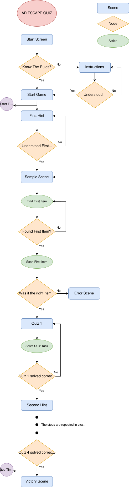

# This Repository contains the EscapeQuizAR

## Introduction

Welcome to the cruel rooms of MCI IV.

A place without lunch rooms, but filled with intense exams that follow you into your dreams.
What begins as a normal day quickly turns into an escape challenge where knowledge, observation, and problem-solving skills are your only tools.

The only way out is to face the challenges ahead:
players must solve difficult quizzes, scan the correct objects, and uncover the path that leads them to freedom.

Be warned — some people have been trapped here for years.
Some never leave.
Some even start a PhD.

The AR Escape Quiz App transforms this exaggerated academic reality into an interactive augmented reality escape room. Using a smartphone, players navigate through scenes, receive hints, scan images, and complete tasks until they finally escape — or remain part of MCI IV forever.

The complete game flow is illustrated in the flow chart included above, which shows all scenes, decisions, and repeated steps. Since several gameplay steps repeat in the same structure, these repetitions are summarized in the chart using three dots to keep the diagram readable.

## Technical Implementation

The application was developed using the following technologies:

### Unity Game Engine

C#
- AR Foundation for cross-platform AR development
- ARCore (Android)
- Smartphone-only interaction

### Core Characteristics

- Image recognition is used to detect specific real-world images
- All interactions are designed for touch input
- No external controllers are required
- The game logic is scene-based and event-driven

## Application Flow Overview

The game starts with a Start Scene, followed by optional instructions.
Once the game begins, a timer is started and the player progresses through multiple cycles of:

0. Start Game 
1. Receiving a hint
2. Finding and scanning the correct image
3. Solving a quiz or task
4. Receiving the next hint

This loop is repeated until all quizzes are solved and the player reaches the Victory Scene, where the timer is stopped and the final time is displayed.

## Scene Description 

### Start Scene

- Entry point of the app
- Provides buttons for:
  - Start Game
-- Introduction
- When Start Game is selected, the game timer is started

### Introduction Scene

- Explains the rules and basic mechanics of the escape quiz
- Describes:
-- Image scanning
-- Quiz interaction
- After confirmation, the player proceeds to the main gameplay

### Sample Scene (Main Scene)

- Central gameplay scene of the application
- Used for:
-- Scanning images
-- Spawning interactive objects
-- Triggering quizzes
- This scene is revisited multiple times throughout the game

### Hint Scenes

- Each hint scene provides guidance for the next task
- Hints are shown only after completing the previous quiz
- Examples:
-- FirstHintRules
-- SecondHintSocket
-- ThirdHintPipe
-- FourthSceneDoor

### Error Scene

- Triggered when the wrong image is scanned
- Provides feedback that the player is on the wrong track
- Does not reveal the solution
- After leaving the error scene, the player can retry scanning

### Victory Scene

- Displayed after the final quiz is solved
- Stops the timer
- Shows the total time needed to complete the escape quiz
- Confirms successful completion of the game

## Link to YouTube Tutorial 
https://www.youtube.com/watch?v=GfS72wqKQ_g 

### Tutorial for AR Foundation Image Matching 

https://www.youtube.com/watch?v=bARrOv48ZSQ

- Detect multiple images
- Assets spawn when image is detected 

## Unity Assets Store 
- Search "props" for furniture, ... 
https://assetstore.unity.com/search#q=props 

